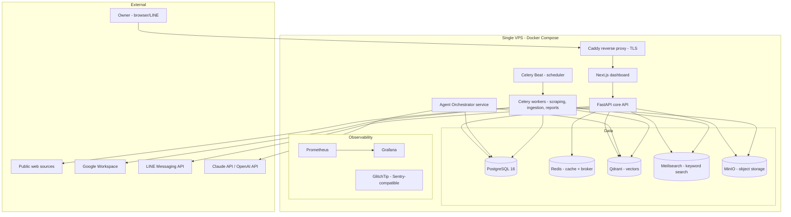
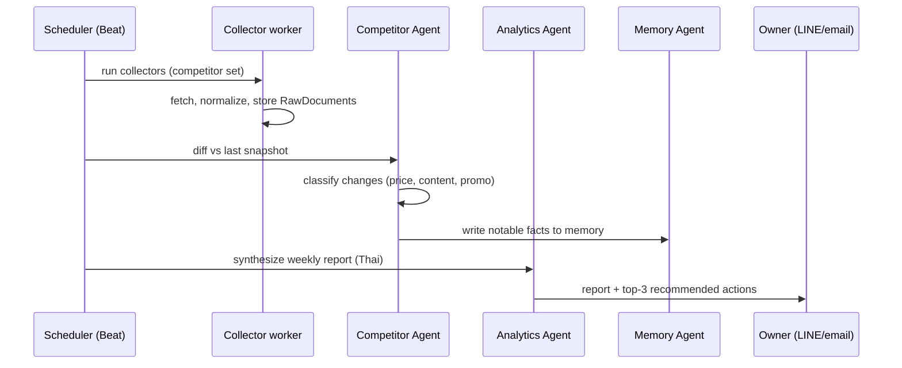

# AI Business OS — System Architecture

**Business:** Koh Samui property renovation → boutique villa rental (howtoniksen.com)
**Sites:** Lipa Noi + Chaweng, Koh Samui, Thailand
**Deployment target:** Owner-controlled VPS (Docker Compose, Kubernetes-ready)
**Document status:** v1.0 — Master architecture, pre-implementation
**Date:** 2026-07-02

---

## 1. Problem Analysis

### 1.1 Business context

The owner operates two properties on Koh Samui currently under renovation (contractor: MR.HOME, per-draw payments in THB), with a trajectory toward a boutique villa rental / slow-living retreat brand. The business passes through three distinct phases, and the OS must serve all three without re-architecture:

| Phase | Focus | OS modules active |
|---|---|---|
| **A — Renovation (now)** | Spend tracking, contractor draws, milestones, quotation review | Knowledge Base, Memory, Automation, Reports |
| **B — Launch** | Brand, listings (Airbnb/Booking/Agoda), direct-booking site, SEO | + Content, Competitor Intel, SEO Agent |
| **C — Operate** | Bookings, guest comms, pricing, occupancy, reviews | + Lead Discovery, Sales, Analytics, full agent fleet |

### 1.2 Core problem

The owner is a solo operator. Information lives in Gmail, LINE, a dashboard HTML file, bank alerts, and the owner's head. Nothing is unified, nothing is automated, and market intelligence (what competing Samui villas charge, how they market, where guests come from) is gathered ad hoc or not at all.

### 1.3 What the OS must do

Continuously: discover potential guests/leads, monitor competing villas, collect market intelligence, generate marketing content, automate reports (Thai-first output), and recommend decisions backed by data — while remaining operable by one person.

### 1.4 Key constraints (drive every decision below)

1. **Solo operator** — ops burden must be near zero. Anything requiring daily babysitting fails.
2. **Cost ceiling** — single VPS budget (~$40–80/mo) + LLM API spend. No managed-service sprawl.
3. **Thai + English** — reports in Thai, marketing content in English, data in THB.
4. **Legal compliance** — Thailand PDPA, platform ToS (Airbnb/Booking/Facebook scraping is largely prohibited — see §8.4), robots.txt, copyright.
5. **Phase-appropriate** — Phase A features must ship value now; Phase C features must not block them.

---

## 2. Requirements

### 2.1 Functional

- **FR-1 Lead discovery:** collect, classify, score, deduplicate, and track leads from legally accessible public sources (see §8).
- **FR-2 Competitor intelligence:** track a defined set of Samui villa competitors — pricing, availability signals, content, reviews, SEO — with daily/weekly/monthly reports.
- **FR-3 Knowledge base:** ingest documents, PDFs, images, emails, meeting notes, contracts, quotations; everything searchable (keyword + semantic).
- **FR-4 AI memory:** long-term memory of businesses, people, campaigns, decisions, with embeddings + RAG.
- **FR-5 Dashboard:** single pane — leads, competitors, tasks, calendar, renovation spend, agent status, system health.
- **FR-6 Automation engine:** scheduled jobs for reports, syncs, notifications (email + LINE).
- **FR-7 Multi-agent orchestration:** specialized agents with defined contracts (see §5).
- **FR-8 Reports:** executive reports in Thai; daily snapshot, Friday wrap-up, monthly close.

### 2.2 Non-functional

- **NFR-1 Reliability:** graceful degradation — a failed scraper never takes down the dashboard. Target 99.5% dashboard availability.
- **NFR-2 Maintainability:** one repo, typed everywhere, CI enforced, docs generated from code where possible.
- **NFR-3 Security:** RBAC (even single-user, for future staff), secrets in vault, encrypted at rest and in transit, audit log.
- **NFR-4 Cost:** LLM calls budgeted per agent per day; hard spend caps.
- **NFR-5 Observability:** every agent run traced; every job logged; alerting to LINE/email on failure.
- **NFR-6 Portability:** Docker Compose on one VPS today; same images run on Kubernetes later with zero code change.

---

## 3. Proposed Architecture

### 3.1 High-level (C4 level 1–2)



### 3.2 Service inventory

| Service | Tech | Responsibility |
|---|---|---|
| `web` | Next.js 15, React, TS, Tailwind, shadcn/ui | Dashboard UI |
| `api` | FastAPI, Python 3.12, SQLAlchemy 2 | REST API, auth, business logic |
| `orchestrator` | Python, LangGraph-style state machines | Agent lifecycle, routing, budgets |
| `worker` | Celery | Scraping, ingestion, embeddings, report generation |
| `beat` | Celery Beat | Cron schedules |
| `postgres` | PostgreSQL 16 | System of record |
| `redis` | Redis 7 | Cache, Celery broker, rate-limit counters |
| `qdrant` | Qdrant | Embeddings / semantic search |
| `meilisearch` | Meilisearch | Keyword search (chosen over Elasticsearch — see §4) |
| `minio` | MinIO | S3-compatible object storage |
| `caddy` | Caddy 2 | TLS, reverse proxy, basic rate limiting |
| `prometheus`, `grafana`, `glitchtip` | — | Metrics, dashboards, error tracking |

### 3.3 Monorepo layout

```
ai-business-os/
├── apps/
│   ├── web/                    # Next.js dashboard
│   │   ├── app/                # App router: (dashboard)/leads, /competitors, /kb, /agents, /reports, /settings
│   │   ├── components/
│   │   ├── lib/api-client/     # Generated from OpenAPI spec
│   │   └── e2e/                # Playwright tests
│   └── api/                    # FastAPI
│       ├── src/
│       │   ├── domain/         # Entities, value objects (no framework imports)
│       │   ├── application/    # Use cases, service interfaces
│       │   ├── infrastructure/ # SQLAlchemy repos, Redis, Qdrant, Meili, MinIO, LLM clients
│       │   ├── interfaces/     # FastAPI routers, schemas (Pydantic), auth middleware
│       │   └── config.py       # Pydantic Settings, env-driven
│       ├── alembic/            # Migrations
│       └── tests/{unit,integration,e2e}/
├── services/
│   ├── orchestrator/           # Agent runtime
│   │   ├── agents/             # One module per agent (see §5)
│   │   ├── tools/              # Tool implementations agents may call
│   │   ├── memory/             # Memory read/write policies
│   │   └── budget.py           # Per-agent token/cost budgets
│   └── collectors/             # Source-specific collectors (see §8)
│       ├── base.py             # Collector interface: fetch() -> RawDocument[]
│       ├── rss.py, sitemaps.py, gmaps_api.py, reddit_api.py, ...
│       └── compliance.py       # robots.txt check, rate limiter, ToS registry
├── packages/
│   ├── shared-types/           # OpenAPI-generated TS types
│   └── prompts/                # Versioned prompt templates (Jinja2), per agent, per language
├── mcp-servers/                # §6 — each server its own package
├── infra/
│   ├── compose/                # docker-compose.yml + overrides (dev/prod)
│   ├── k8s/                    # Helm chart (future)
│   ├── terraform/              # VPS + DNS + S3 backup bucket (optional)
│   └── backup/                 # pg_dump + MinIO sync scripts
├── docs/                       # ADRs, runbooks, diagrams
└── .github/workflows/          # CI/CD
```

---

## 4. Trade-offs & Key Decisions (ADR summary)

| # | Decision | Alternatives rejected | Rationale |
|---|---|---|---|
| ADR-1 | **Single VPS + Docker Compose** | K8s now, managed PaaS | Solo operator, cost ceiling. Images are 12-factor; Helm chart kept in repo for later. |
| ADR-2 | **Meilisearch over Elasticsearch** | Elasticsearch | ES needs 2–4 GB heap alone; Meili runs in ~100 MB, sub-50 ms Thai-capable search. |
| ADR-3 | **Celery + Redis over Temporal** | Temporal | Temporal adds a whole server cluster + new mental model. Celery is enough for cron + retries at this scale. Revisit if workflows exceed ~20 chained steps. |
| ADR-4 | **Custom lightweight agent runtime over CrewAI/AutoGen frameworks** | CrewAI, AutoGen | Frameworks churn fast and hide token spend. A ~500-line orchestrator with explicit state machines is auditable and budgetable. |
| ADR-5 | **Auth.js (web) + API keys (services)** | Clerk, Better Auth | No per-MAU vendor cost; single-tenant. RBAC roles seeded for future staff. |
| ADR-6 | **API-first + official APIs for data collection; scraping only where ToS-permitted** | Headless-scrape everything | Legal compliance is a hard constraint (§1.4). See §8.4 for the source policy matrix. |
| ADR-7 | **Claude API primary, OpenAI fallback, bge-m3 local embeddings** | Single provider | bge-m3 is multilingual (Thai!) and free to run on CPU; LLM router allows failover and cost tiering (Haiku-class for classification, Sonnet-class for reports). |
| ADR-8 | **GlitchTip over Sentry SaaS** | Sentry cloud | Self-hosted, Sentry-SDK-compatible, no per-event pricing. |
| ADR-9 | **MinIO over cloud S3** | AWS S3 | Data locality on VPS; nightly encrypted sync to Backblaze B2 for off-site backup (cheap). |

---

## 5. Multi-Agent Architecture

### 5.1 Design principles

- Agents are **stateless functions over shared state** (Postgres + Qdrant). No agent holds private long-lived state.
- Every run is a **traced, budgeted, resumable job**: `agent_runs` table records inputs, outputs, tokens, cost, latency, verdict.
- Agents communicate **only via the task queue and shared DB** — no direct agent-to-agent calls. This makes every hand-off inspectable.
- **Cheap model by default** (classification, extraction), expensive model only for synthesis (reports, strategy).

### 5.2 Agent roster (phased)

| Agent | Phase | Responsibility | Inputs | Outputs | Model tier |
|---|---|---|---|---|---|
| **Planner** | A | Decompose goals into tasks, maintain roadmap | Owner goals, backlog | Task graph | High |
| **Scheduler** | A | Own cron calendar, trigger agents | Schedule config | Celery jobs | None (deterministic) |
| **Memory** | A | Write/consolidate/expire memories, dedupe facts | All agent outputs | Memory records + embeddings | Low |
| **Research** | A | Ad-hoc deep dives (suppliers, regulations, market) | Query | Cited brief | High |
| **Competitor** | B | Monitor competitor set, diff changes, flag moves | Collector output | Change events, SWOT deltas | Low→High |
| **SEO** | B | Track keywords, audit site, content gaps | Search console, Ahrefs MCP | SEO tasks, briefs | Mid |
| **Content** | B | Draft posts/newsletters/listing copy (EN), Thai summaries | Briefs, brand guide | Drafts for approval | High |
| **Social** | B | Schedule approved content via Postiz | Approved drafts | Scheduled posts | Low |
| **Customer Discovery** | C | Classify/score/cluster leads | Raw lead docs | Scored leads | Low |
| **Sales** | C | Follow-up suggestions, draft outreach (approval-gated) | Scored leads, history | Draft messages | Mid |
| **Email** | C | Triage inbox, draft replies, extract commitments | Gmail MCP | Labels, drafts, tasks | Low |
| **Analytics** | C | KPI computation, anomaly detection, decision memos | All DB data | Executive report sections | High |
| **QA/Evaluator** | A | Score other agents' outputs vs rubrics, regression-test prompts | Agent runs | Eval scores, alerts | Mid |

### 5.3 Common agent contract

Every agent implements:

```python
class Agent(Protocol):
    name: str
    model_tier: ModelTier                 # LOW | MID | HIGH
    daily_budget_usd: Decimal
    def plan(self, task: Task, ctx: Context) -> list[Step]: ...
    def execute(self, step: Step, tools: ToolRegistry) -> StepResult: ...
    def on_failure(self, err: AgentError) -> FailurePolicy:  # RETRY | ESCALATE | ABORT
```

**Failure handling:** 3 retries with exponential backoff → escalate to owner via LINE with context → task parked, never silently dropped.
**Evaluation:** QA agent samples 10% of runs + all HIGH-tier runs; rubric scores stored in `agent_evals`; weekly prompt-regression suite runs against golden test cases before any prompt template change is merged (prompts are versioned in `packages/prompts`).

### 5.4 Orchestration flow (example: weekly competitor report)



---

## 6. MCP Architecture

MCP servers expose internal capabilities to Claude/Cowork and keep tool logic out of agent code. Each is an independent package in `mcp-servers/`, FastMCP (Python), stdio + SSE transports, documented with a README + tool schema table.

| MCP server | Tools (representative) | Backing store |
|---|---|---|
| `crm` | search_leads, get_lead, update_stage, log_touch | Postgres |
| `knowledge-base` | search (hybrid), ingest_document, get_document | Meili + Qdrant + MinIO |
| `competitor-intel` | list_competitors, get_snapshot_diff, get_report | Postgres |
| `memory` | remember, recall, consolidate | Postgres + Qdrant |
| `analytics` | kpi_query, spend_by_site, occupancy (Phase C) | Postgres |
| `automation` | list_jobs, trigger_job, job_status | Celery API |
| `line-notify` | send_message, send_report | LINE Messaging API |
| `renovation` | draws_outstanding, spend_by_category, milestone_status | Postgres (Phase A data) |

Third-party MCPs already available (Gmail, Calendar, Drive, Ahrefs, Canva, Postiz) are consumed as-is — no re-wrapping.

---

## 7. Database Design (core schema)

PostgreSQL, one schema, Alembic-managed. UUIDv7 PKs, `created_at/updated_at` everywhere, soft deletes on business entities, row-level audit via trigger → `audit_log`.

```sql
-- Identity & access
users(id, email, name, role, locale, created_at)          -- role: owner|staff|readonly
api_keys(id, user_id, name, hash, scopes[], expires_at)

-- Phase A: renovation
sites(id, name, location, budget_thb)                       -- Lipa Noi, Chaweng
contractors(id, name, contact, line_id)
quotations(id, site_id, contractor_id, category, amount_thb, status, document_id)
draws(id, quotation_id, seq, amount_thb, status, requested_at, paid_at, evidence_document_id)
milestones(id, site_id, name, planned_date, actual_date, status)

-- Leads (Phase C, schema ready now)
leads(id, source_id, kind, name, contact_json, locale, intent_score, stage,
      cluster_id, first_seen_at, last_activity_at, dedup_hash)
lead_events(id, lead_id, type, payload_json, occurred_at)
lead_scores(id, lead_id, model_version, score, features_json, scored_at)

-- Competitor intelligence
competitors(id, name, kind, website, listing_urls_json, active)
snapshots(id, competitor_id, source_id, captured_at, content_hash, storage_key)  -- raw in MinIO
change_events(id, competitor_id, snapshot_id, category, summary, severity, detected_at)

-- Collection layer
sources(id, name, type, url, tos_policy, robots_ok, rate_limit_per_hr, enabled)
raw_documents(id, source_id, fetched_at, content_hash, storage_key, status)      -- dedup by hash

-- Knowledge base & memory
documents(id, title, mime, storage_key, lang, ocr_done, meili_indexed, embedded)
chunks(id, document_id, seq, text, qdrant_point_id)
memories(id, kind, subject, body, importance, embedding_point_id, expires_at, source_run_id)

-- Agents & automation
agent_runs(id, agent, task_id, status, model, tokens_in, tokens_out, cost_usd,
           started_at, finished_at, error, parent_run_id)
agent_evals(id, run_id, rubric, score, notes)
jobs(id, name, cron, enabled, last_run_at, last_status)
reports(id, kind, period, lang, storage_key, generated_by_run_id, sent_at)

audit_log(id, actor, action, entity, entity_id, diff_json, at)
```

Vector data (Qdrant): collections `kb_chunks`, `memories`, `leads` — bge-m3 1024-dim, cosine, payload carries Postgres FK for join-back.

---

## 8. Lead Discovery & Data Collection

### 8.1 Pipeline

```
Source registry → Collector (rate-limited, robots-aware) → RawDocument (deduped by content hash)
→ Extractor (LLM-low: structure, language, entities) → Classifier (lead? competitor-signal? noise?)
→ Scorer (intent 0–100: keywords, recency, specificity, channel) → Deduplicator (hash + embedding similarity ≥0.92)
→ Clusterer (HDBSCAN over embeddings, weekly) → CRM stage 'discovered' → Sales Agent suggestions
```

### 8.2 Lead types for this business

- **Guests (B2C):** travelers asking for Samui villa recommendations on Reddit (r/Thailand, r/kohsamui, r/digitalnomad), travel forums, blog comments.
- **Long-stay / nomads:** monthly-stay seekers — high value, low OTA fees.
- **B2B:** retreat organizers, yoga/wellness facilitators, photographers/production scouts, relocation agents.
- **Phase A leads:** suppliers and trades (pool, landscaping, furniture) — same pipeline, different classifier labels.

### 8.3 Scoring features

Recency, explicitness of intent ("looking to book", dates mentioned), budget signals, group size, channel authority, prior interactions (memory), language match.

### 8.4 Source policy matrix (compliance is enforced in code, not by convention)

| Source | Method | Policy |
|---|---|---|
| Reddit | Official API (OAuth) | ✅ Allowed within API terms + rate limits |
| RSS feeds, blogs, news | Feed/HTTP fetch | ✅ robots.txt respected, cache honored |
| Google Maps / Business | Official Places API | ✅ Paid API only; no SERP scraping |
| Government/open data | Direct download | ✅ |
| Tourism directories | Fetch if robots-allowed | ✅ per-source review, recorded in `sources.tos_policy` |
| Facebook Pages/Groups | — | ⚠️ Scraping prohibited by ToS. Only: official Graph API for **own** pages, or manual owner-forwarded content. The collector registry will refuse a facebook.com URL. |
| Airbnb / Booking / Agoda | — | ⚠️ Scraping prohibited. Use: own-listing APIs/exports, licensed market-data providers (AirDNA), and public aggregate stats. Competitor rate checks limited to manual spot-checks or licensed data. |
| Email newsletters | Legitimate subscription | ✅ Parsed from Gmail |

`services/collectors/compliance.py` gates every fetch: robots.txt check (cached), per-source rate limiter (Redis), ToS policy flag must be `allowed`, User-Agent identifies the bot honestly. Violations are structurally impossible, not merely discouraged.

### 8.5 PDPA (Thailand)

Personal data in leads is minimized (public handle + public post content only), purpose-limited, retention-capped (18 months inactivity → anonymize), and deletable on request. `leads.contact_json` is encrypted at rest (pgcrypto).

---

## 9. Competitor Intelligence

**Competitor set (owner-curated, ~10–20):** boutique villas in Lipa Noi/West coast and Chaweng, plus 2–3 aspirational brands. Stored in `competitors`.

**Tracked per competitor:** website content diffs (sitemap + page snapshots), blog/social posts (RSS/official APIs), Google Business profile changes (Places API), review velocity + sentiment, SEO keyword movements (Ahrefs MCP — already connected), newsletter content (subscribed), public promo announcements.

**Outputs:**
- **Daily:** change feed on dashboard (silent unless severity ≥ high).
- **Weekly (Thai):** what changed, so-what analysis, top-3 suggested responses.
- **Monthly:** SWOT delta, positioning map (price × review score), trend analysis, content-gap report feeding the SEO/Content agents.

Diff detection: normalized text snapshot → content_hash compare → LLM-low summarizes the diff → severity classifier → `change_events`.

---

## 10. Knowledge Base, Memory & RAG

**Ingestion:** upload/Gmail-attachment/Drive-sync → MinIO (original) → parser (PDF: pdfplumber + OCR fallback via Tesseract w/ Thai traineddata; images: vision-model caption; audio: whisper) → chunking (semantic, 512-token target) → Meilisearch (keyword, Thai tokenization) + Qdrant (bge-m3 embeddings).

**Hybrid search:** Reciprocal Rank Fusion over Meili + Qdrant results; re-rank top-20 with bge-reranker; return top-5 with citations. Exposed via `knowledge-base` MCP and dashboard search.

**Memory policy:** Memory Agent writes facts with `kind` (business|person|competitor|campaign|decision|task), importance 1–5, optional expiry. Weekly consolidation merges duplicates (embedding similarity), decays stale low-importance items. All agent context assembly = task description + top-k memories + top-k KB chunks, capped by token budget.

---

## 11. API Design (representative)

REST, OpenAPI-generated client for the frontend. JWT (Auth.js session → API token) or API key. Versioned under `/v1`.

```
GET  /v1/leads?stage=&min_score=&q=          # cursor pagination
POST /v1/leads/{id}/stage
GET  /v1/competitors/{id}/changes?since=
GET  /v1/kb/search?q=&mode=hybrid
POST /v1/kb/documents                         # multipart upload
GET  /v1/agents/runs?agent=&status=
POST /v1/agents/{name}:trigger
GET  /v1/reports?kind=weekly
GET  /v1/renovation/sites/{id}/summary        # Phase A
POST /v1/jobs/{id}:run
GET  /v1/health  /v1/metrics                  # liveness, Prometheus
```

Conventions: RFC 9457 problem+json errors, idempotency keys on mutating agent triggers, rate limits per key (Redis), all writes audited.

---

## 12. Dashboard (UI flow)

Next.js app router, server components for data, shadcn/ui, Thai/English i18n (owner default: Thai).

- **Home:** today's snapshot — renovation draws outstanding (Phase A), new leads, competitor changes, agent failures, top-3 AI recommendations.
- **Renovation:** per-site spend vs quotation by category, draw pipeline, milestone Gantt.
- **Leads:** pipeline board (discovered → qualified → contacted → won/lost), score explanations, suggested follow-ups (approval-gated).
- **Competitors:** change feed, positioning map, report archive.
- **Knowledge Base:** hybrid search, document viewer, ingest status.
- **Agents:** run history, cost per agent per day, eval scores, budget bars.
- **Reports:** archive, regenerate, send-to-LINE.
- **Settings:** sources registry (with ToS policy visible), schedules, budgets, API keys.

---

## 13. Automation Engine (initial schedule)

| Job | Schedule | Agent/worker |
|---|---|---|
| Collector sweep (competitors) | 06:00 daily | collectors |
| Collector sweep (lead sources) | every 4 h | collectors |
| Lead scoring batch | 07:00 daily | Customer Discovery |
| Daily snapshot → LINE (Thai) | 07:30 daily | Analytics |
| Gmail triage | every 2 h | Email Agent |
| Weekly competitor report | Mon 08:00 | Competitor + Analytics |
| Friday wrap-up (Thai) | Fri 17:00 | Analytics |
| Memory consolidation | Sun 03:00 | Memory |
| Prompt regression suite | on PR + Sun 04:00 | QA |
| pg_dump + MinIO → B2 backup | 02:00 daily | ops script |
| KB re-embed check | Sun 05:00 | worker |

---

## 14. Security

- **AuthN/Z:** Auth.js (email magic-link + TOTP), roles owner/staff/readonly enforced in API dependency layer; MCP servers require scoped API keys.
- **Secrets:** SOPS + age-encrypted `.env` files in repo; decrypted only on VPS at deploy. (Vault is overkill for one node — documented as upgrade path.)
- **Network:** only 80/443 exposed (Caddy); everything else on internal Docker network; SSH key-only + fail2ban; UFW default-deny.
- **Data:** TLS everywhere, pgcrypto for PII columns, MinIO SSE, encrypted off-site backups (age).
- **App:** Pydantic validation on every input, output encoding, CSRF on session routes, rate limiting (Caddy + Redis), dependency scanning (Dependabot + pip-audit + npm audit in CI), OWASP ASVS L1 checklist in `docs/security.md`.
- **Audit:** all mutations + all agent actions in `audit_log`; agent outbound messages (email/LINE drafts) are approval-gated by default.
- **DR:** nightly backups tested by weekly automated restore-to-scratch-container job; RPO 24 h, RTO 4 h (runbook: `docs/runbooks/restore.md`).

---

## 15. Testing Strategy

| Layer | Tooling | Gate |
|---|---|---|
| Unit (domain, scoring, dedup) | pytest, hypothesis | CI, 85% cov on domain/ |
| API integration | pytest + testcontainers (PG, Redis, Qdrant) | CI |
| Frontend | Vitest + React Testing Library | CI |
| E2E | Playwright vs docker-compose stack | CI (nightly + pre-release) |
| Prompt regression | golden-set evals per agent, scored by QA agent rubric | CI on prompt changes |
| Load | Locust profile: 50 rps API, collector burst | pre-release |
| Security | pip-audit, npm audit, trivy image scan, ZAP baseline | CI weekly |

---

## 16. Deployment & CI/CD

**VPS baseline:** 4 vCPU / 8 GB / 160 GB NVMe (~$50/mo, Hetzner CPX31-class), Ubuntu 24.04 LTS, Docker + Compose v2.

**Pipeline (GitHub Actions):**
1. PR → lint (ruff, eslint, tsc), unit + integration tests, image build, trivy scan.
2. Merge to `main` → build multi-arch images → push GHCR → tag `staging`.
3. Release tag → SSH deploy: `docker compose pull && docker compose up -d` with health-check gating; automatic rollback to previous image tag if `/v1/health` fails within 120 s.
4. Alembic migrations run as a pre-start one-shot container; every migration ships a tested `downgrade()` (rollback strategy).

**Kubernetes readiness:** stateless services, config via env, health/readiness probes already exposed, Helm chart skeleton in `infra/k8s/`. Migration = provision managed PG + object storage, `helm install`, cut DNS.

---

## 17. Monitoring & Self-Improvement

- **Metrics:** Prometheus scrapes api/worker/orchestrator (request latency, queue depth, collector success rate, tokens + USD per agent). Grafana dashboards: System, Agents & Cost, Collection health.
- **Alerts → LINE:** service down, job failed twice, daily LLM spend > cap, disk > 80%, backup missed.
- **Errors:** GlitchTip with release tagging.
- **Self-improvement loop (institutionalized, not aspirational):** QA agent's weekly eval report ranks worst-performing prompts/agents → Planner opens improvement tasks → changes land as versioned prompt PRs gated by regression evals → impact measured by eval-score delta and owner-feedback thumbs (dashboard). Technical debt register in `docs/tech-debt.md`, groomed monthly by Planner agent + owner. Changelog: `CHANGELOG.md`, keep-a-changelog format, enforced by CI.

---

## 18. Roadmap & Milestones

| Milestone | Scope | Duration | Exit criteria |
|---|---|---|---|
| **M0 — Foundation** | Monorepo, CI, compose stack, auth, DB schema, dashboard shell, observability | 2 wks | Stack deploys to VPS via pipeline; health green; backups running |
| **M1 — Renovation module** | Sites/quotations/draws/milestones UI + Gmail bank-alert ingestion + daily Thai snapshot to LINE | 2 wks | Owner retires manual dashboard HTML |
| **M2 — Knowledge base + memory** | Ingestion, hybrid search, memory MCP, RAG context assembly | 2 wks | Quotations & contracts searchable in Thai/EN |
| **M3 — Competitor intelligence** | Competitor registry, collectors, diffing, weekly Thai report | 3 wks | 10 competitors tracked; first weekly report approved by owner |
| **M4 — Agent runtime + QA** | Orchestrator, budgets, evals, Planner/Analytics/Memory agents live | 3 wks | All reports agent-generated; cost dashboard live |
| **M5 — Lead discovery** | Source registry, compliant collectors, classify/score/dedup, CRM board | 3 wks | ≥20 scored leads/wk from ≥3 sources; precision ≥70% on owner review |
| **M6 — Content & SEO** (Phase B gate) | SEO agent (Ahrefs), content agent, Postiz publishing, brand guide | 3 wks | 4-wk content calendar generated & approved |
| **M7 — Operations** (Phase C gate) | Booking data ingestion, occupancy/pricing analytics, guest comms agents | post-launch | Defined at Phase C kickoff |

**Estimated run-rate cost:** VPS ~$50 + backups ~$5 + LLM $30–100 (budget-capped) + Google APIs ~$10 ≈ **$95–165/mo**.

---

## 19. Risks & Open Questions

1. **OTA data access** — competitor pricing on Airbnb/Booking is the highest-value intel and the most ToS-restricted. Mitigation: licensed data (AirDNA ~$20–40/mo) budgeted from M3; decision needed.
2. **LLM cost creep** — mitigated by hard per-agent caps + tier routing; monitored from M4.
3. **Solo-operator bus factor** — runbooks + one-command restore mandatory (M0 exit criteria).
4. **Thai NLP quality** — bge-m3 + Meili handle Thai well, but OCR of Thai handwritten quotations is unreliable; keep manual-correction UI in M2.
5. **Scope discipline** — every phase-C feature request before launch gets parked in the backlog by default.

---

## 20. Immediate Next Steps

1. Owner reviews & approves this architecture (esp. §8.4 source policy and §18 roadmap).
2. Confirm VPS provider + provision (Terraform in `infra/terraform`).
3. Kick off **M0 — Foundation** scaffold.

*Document maintained at `docs/ARCHITECTURE.md` in the repo once M0 begins. Changes via ADRs in `docs/adr/`.*
